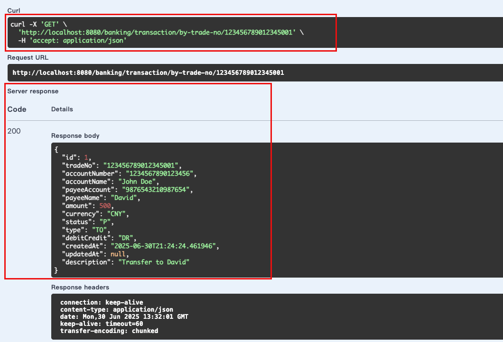
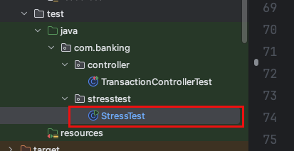

# Banking Transaction Management System

A simple banking transaction system built with Java 21 and Spring Boot 3.2.1

#### Swagger URL:
http://localhost:8080/banking/swagger-ui/index.html

You can operate in the swagger UI, to create/update/delete/query transactions.


#### H2 memory DB

Connection URL: http://localhost:8080/banking/h2-console

Connection Info:

- Driver Class: org.h2.Driver

- JDBC URL: jdbc:h2:mem:banking_db
- User Name: sa
- Password: test


And you will see the table created:


### API endpoints

**1. Create a new transaction:**

```bash
curl -X POST http://localhost:8080/banking/transaction \
  -H "Content-Type: application/json" \
  -d '{
    "tradeNo": "123456789012345001",
    "accountNumber": "1234567890123456",
    "accountName": "John Doe",
    "payeeAccount": "9876543210987654",
    "payeeName": "David",
    "amount": 500.00,
    "currency": "CNY",
    "type": "TO",
    "debitCredit": "DR",
    "description": "Transfer to David"
  }'
```

create in swagger UI:


**2. List transactions by pagination:**

Get with custom pagination
```
curl -X GET "http://localhost:8080/banking/transaction?page=0&size=10"
```


**3. Get transaction by ID:**
```bash
curl -X GET http://localhost:8080/banking/transaction/1
```


**4. Get transaction by TradeNo:**
```bash
curl -X GET http://localhost:8080/banking/transaction/by-trade-no/123456789012345001
```




**5. Update a transaction:**
```bash
curl -X PUT http://localhost:8080/banking/transaction/1 \
  -H "Content-Type: application/json" \
  -d '{
    "tradeNo": "123456789012345001",
    "accountNumber": "1234567890123456",
    "accountName": "John Doe Updated",
    "payeeAccount": "9876543210987654",
    "payeeName": "David",
    "amount": 750.00,
    "currency": "CNY",
    "type": "TO",
    "debitCredit": "DR",
    "description": "Transfer to David"
  }'
```


**6. Update transaction by TradeNo:**
```bash
curl -X PUT http://localhost:8080/banking/transaction/by-trade-no/123456789012345001 \
  -H "Content-Type: application/json" \
  -d '{
    "accountNumber": "1234567890123456",
    "accountName": "John Doe Modified",
    "payeeAccount": "9876543210987654",
    "payeeName": "David",
    "amount": 1000.00,
    "currency": "CNY",
    "type": "TO",
    "debitCredit": "DR",
    "description": "Transfer to David"
  }'
```


**7. Delete a transaction by id:**
```bash
curl -X DELETE http://localhost:8080/banking/transaction/1
```


**8. Delete transaction by TradeNo:**
```bash
curl -X DELETE http://localhost:8080/banking/transaction/by-trade-no/123456789012345001
```


#### API Unit test

API unit test 类位于


包括了全面的参数的验证


### Unit Tests
```bash
mvn test -Dtest=TransactionServiceTest
```

#### API Stress test

- start the application firstly
```
mvn spring-boot:run
```


- you can login h2 database to verify no data there


- Start the stress test in StressTest.java to insert 100000 records


Below is the result of the stress test. You can see the throughput is 7423.35/sec


Check the H2 database, you can see the data has been inserted successfully


### Run in docker

Run in docker (ensure you have docker installed and running):

```bash
docker build -t banking-transaction .
docker run -p 8080:8080 banking-transaction
```


check status


