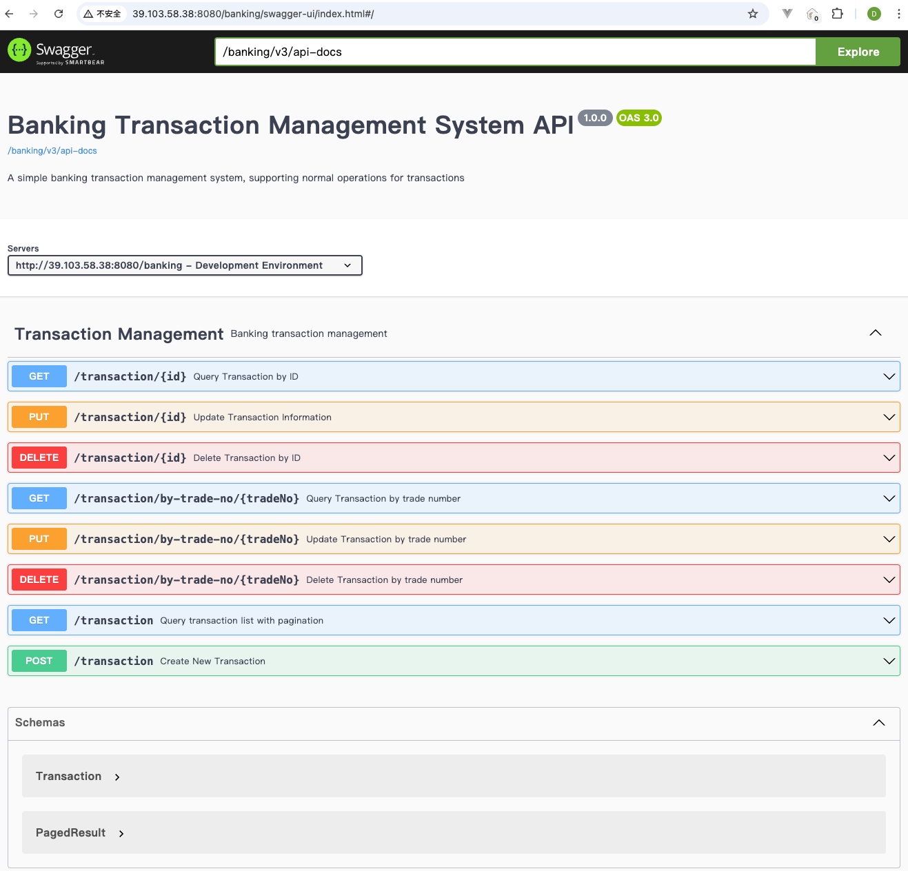
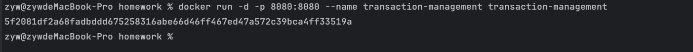

# Banking Transaction Management System


### Description

I am Zou Yongwei (邹永卫). This is a simple banking transaction system built with Java 21 and Spring Boot 3.2.1.

I designed the transaction with core fields. Of course, there are more fields need to be included in real world banking system. 

I also write several comments in the code where begins with 'Note', to record what I was thinking when coding. Please let me know if you have any concerns or questions. Thank you.


### Features

\- Write in Java 21 and Spring Boot

\- The primary entity is the transaction

\- All data was held in memory (H2 Database)

 \- Clear and well-structured API

 \- Emphasis on performance for all core operations

 \- Comprehensive testing, including unit and stress testing

 \- Containerization with tool, see the Docker file

 \- Implement caching mechanisms

 \- Robust validation and exception handling

 \- Efficient data queries and pagination

 \- Followed RESTful API design principles

\- It's a stand-alone project that is straightforward to run and test

\- Use Maven for project management

\- Support page functionalities, see the swagger UI

 

###  API Implemented

\- Create transaction

\- Delete transaction (by id or trade number)

\- Modify transaction (by id or trade number)

\- List all transactions (by page)

\- Implemented error handling for scenarios, including creating duplicate transactions or deleting a non-existent transaction and so on

\- Including perform unit testing on the API to ensure robustness and reliability

\- The API can withstand stress tests and maintain performance under load (please review the testing result)


### Online Swagger URL

If you want to check the API details quickly. 
To save your time, you can also check the swagger UI online.

I have my own alibaba cloud server and I deployed the project to my server:

http://39.103.58.38:8080/banking/swagger-ui/index.html



I have inserted 1000 records in the H2 database.


### Using H2 memory DB

Connection URL: http://localhost:8080/banking/h2-console

Connection Info:

- Driver Class: org.h2.Driver

- JDBC URL: jdbc:h2:mem:banking_db
- User Name: sa
- Password: test


And you will see the table created:


### Local Swagger URL

http://localhost:8080/banking/swagger-ui/index.html

You can operate in the swagger UI, to create/update/delete/query transactions.


### API endpoints and swagger operations

**1. Create a new transaction:**

```bash
curl -X POST http://localhost:8080/banking/transaction \
  -H "Content-Type: application/json" \
  -d '{
    "tradeNo": "123456789012345001",
    "accountNumber": "1234567890123456",
    "accountName": "John Doe",
    "payeeAccount": "9876543210987654",
    "payeeName": "David",
    "amount": 500.00,
    "currency": "CNY",
    "type": "TO",
    "debitCredit": "DR",
    "description": "Transfer to David"
  }'
```

create in swagger UI:


**2. List transactions by pagination:**

Get with custom pagination
```
curl -X GET "http://localhost:8080/banking/transaction?page=0&size=10"
```


**3. Get transaction by ID:**
```bash
curl -X GET http://localhost:8080/banking/transaction/1
```


**4. Get transaction by TradeNo:**
```bash
curl -X GET http://localhost:8080/banking/transaction/by-trade-no/123456789012345001
```


**5. Update a transaction:**
```bash
curl -X PUT http://localhost:8080/banking/transaction/1 \
  -H "Content-Type: application/json" \
  -d '{
    "tradeNo": "123456789012345001",
    "accountNumber": "1234567890123456",
    "accountName": "John Doe Updated",
    "payeeAccount": "9876543210987654",
    "payeeName": "David",
    "amount": 750.00,
    "currency": "CNY",
    "type": "TO",
    "debitCredit": "DR",
    "description": "Transfer to David"
  }'
```


**6. Update transaction by TradeNo:**
```bash
curl -X PUT http://localhost:8080/banking/transaction/by-trade-no/123456789012345001 \
  -H "Content-Type: application/json" \
  -d '{
    "accountNumber": "1234567890123456",
    "accountName": "John Doe Modified",
    "payeeAccount": "9876543210987654",
    "payeeName": "David",
    "amount": 1000.00,
    "currency": "CNY",
    "type": "TO",
    "debitCredit": "DR",
    "description": "Transfer to David"
  }'
```


**7. Delete a transaction by id:**
```bash
curl -X DELETE http://localhost:8080/banking/transaction/1
```


**8. Delete transaction by TradeNo:**
```bash
curl -X DELETE http://localhost:8080/banking/transaction/by-trade-no/175129006099700099
```


### API Unit test

Start below API unit test class:


I included different cases:


### API Stress test

- start the application firstly through below command or you can start it in IntelliJ IDEA
```
mvn spring-boot:run
```


- Login h2 database to verify no data there


- Start the stress test in StressTest.java to insert 100000 records


Below is the result of the stress testing. You can see the throughput is 7423.35/sec


Check the H2 database, you can see the data has been inserted successfully


### Run in docker

Run in docker (ensure you have docker installed and running):

```bash
docker build -t transaction-management . 
docker run -d -p 8080:8080 --name transaction-management transaction-management
docker logs transaction-management
```

build the image:


Run the image:




You can see it's started in docker container:


Open the swagger and you access.


